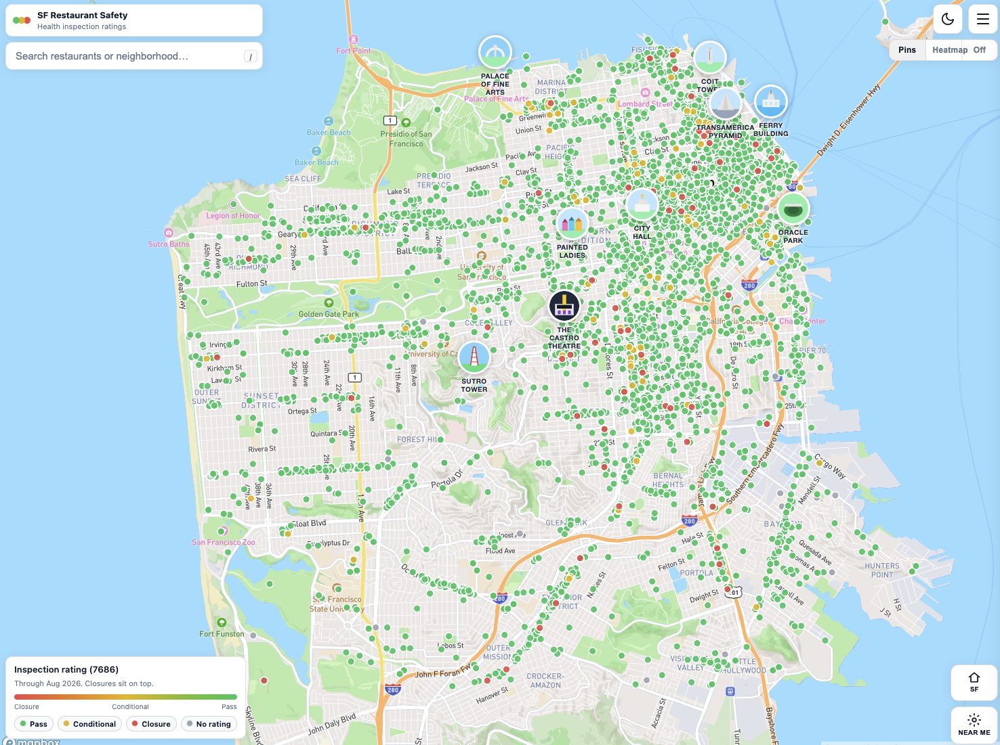
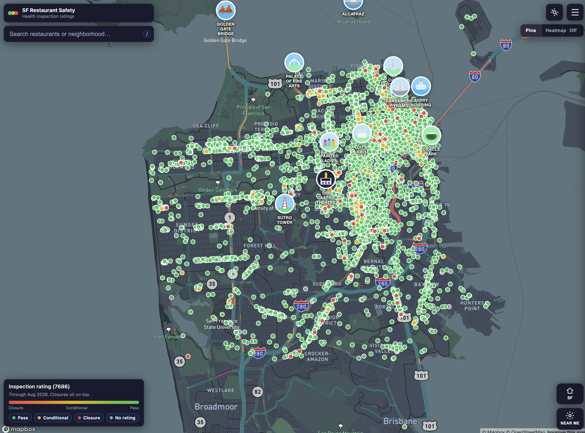
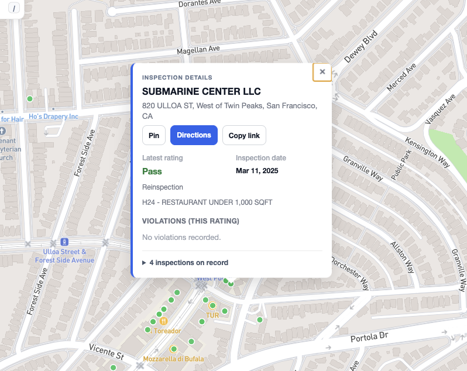
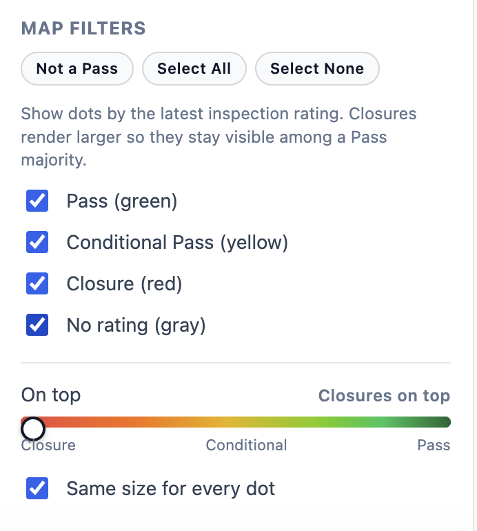
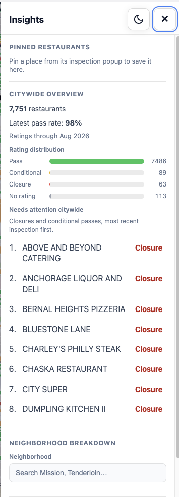

# SF Restaurant Safety Map

Interactive web app that maps every San Francisco restaurant health inspection on a Mapbox-rendered map. Click a dot to see the latest rating (Pass / Conditional Pass / Closure), the inspection date, and the violations recorded that day. Search by name or neighborhood, filter by rating, jump to your current location, and open an Insights panel for citywide stats and a per-neighborhood breakdown. No account required.

Data comes from the city's current public health-inspection feed: [DataSF — Health Inspection Scores (2024–Present)](https://data.sfgov.org/Health-and-Social-Services/Health-Inspection-Scores-2024-Present-/tvy3-wexg).

## Screenshots

Map view with score-colored pins and legend (thousands of restaurants across the city).



Dark mode basemap.



Click any pin to open inspection details: address, latest rating, inspection date, and violations.



Map filters and overlay controls (pins, heatmap, rating visibility).



Insights panel with citywide stats, rating distribution, and neighborhood drilldown.



## Tech stack

- **Backend:** Python 3.10+, Flask 3, Flask-CORS, SQLite (read-only at request time)
- **Frontend:** React 18, Vite 5, react-map-gl, mapbox-gl, axios
- **Data pipeline:** Python, pandas, geopy (OpenStreetMap Nominatim for backfilling missing coordinates)
- **Storage:** SQLite file at `backend/db/safety.db`, built from cleaned CSVs in `data/processed/`

## What's in the box

- One-click circle markers colored by **Pass / Conditional Pass / Closure** (green / yellow / red). Closures and conditional passes render larger by default so they stay visible among a Pass majority.
- Choose which ratings sit on top (closures / conditional / passes) and optionally make every dot the same size.
- Restaurant search with instant typeahead over the loaded map. Typing a neighborhood name (for example `Mission` or `Tenderloin`) flies the map to that neighborhood's centroid.
- Click any dot for an inspection-detail popup: name, address, latest **rating**, date, violations, pin/save, **Directions** in Apple Maps or Google Maps, and **Copy link** to share that restaurant (`?r=`).
- Pin restaurants from a popup; they get a star on the map and a saved list in Insights, with one-tap directions.
- Landmark pins (Golden Gate Bridge, Ferry Building, Oracle Park, and others) appear as you zoom in.
- "Near Me" button uses the browser's geolocation API to recenter the map. **SF** resets to the city view.
- Light/dark Mapbox basemap toggle (remembered with overlay, filters, and pin-stack settings). Click the brand chip to reopen the intro splash.
- Insights side panel with citywide totals, a pass-rate readout, a rating-distribution mini chart, the citywide needs-attention list, and a per-neighborhood drilldown. Click a restaurant to fly the map and open its inspection popup.
- Rating map filters (show/hide Pass, Conditional Pass, Closure, no-rating dots).
- Pins / Heatmap / Off overlay toggle. Heatmap weights Closures and Conditional Passes more heavily so problem clusters stand out.

## Repository layout

```
backend/        Flask API (app factory, blueprints, SQLite helpers)
  app/
    __init__.py        create_app(), CORS, blueprint registration, /api/health
    config.py          SAFETY_DB_PATH env override, defaults
    routes/
      restaurants.py   /api/restaurants list + detail + inspections
      inspections.py   /api/inspections/<business_id>
      stats.py         /api/stats and /api/stats/neighborhoods
    utils/db.py        read-only per-request connection, startup indexes
  db/.gitkeep          safety.db is generated, not committed
  requirements.txt
  run.py               dev entry point (HOST/PORT env, --no-debug)

frontend/       Vite + React app
  src/App.jsx          single-file UI: map, search, sidebar, popup, filters
  src/main.jsx         React root
  src/styles/          CSS
  vite.config.js       dev server on port 5173, proxies /api → :5001
  .env.example         Mapbox token + optional VITE_API_BASE
  package.json

scripts/        Data pipeline (run in this order)
  fetch_data.py        Pull the full DataSF feed to data/raw/inspections_raw.json
  clean_data.py        Normalize into restaurants/inspections/violations CSVs,
                       optionally geocoding missing addresses via Nominatim
  load_db.py           Load CSVs into backend/db/safety.db
  requirements.txt

data/processed/ Cleaned CSVs (restaurants, inspections, violations) + Nominatim cache
```

## Setup

### Prerequisites

- Python 3.10+
- Node.js 18+ and npm
- A free [Mapbox access token](https://account.mapbox.com/access-tokens/) for the frontend

### 1. Backend

```bash
cd backend
python -m venv .venv
source .venv/bin/activate          # Windows: .venv\Scripts\activate
pip install -r requirements.txt
```

The DB file `backend/db/safety.db` is gitignored. Build it from the committed CSVs:

```bash
cd ..
pip install -r scripts/requirements.txt
python scripts/load_db.py
```

This produces `backend/db/safety.db` from the CSVs already in `data/processed/`. No network, no geocoding, no DataSF API call needed for this path. Takes a few seconds.

Then run the API:

```bash
cd backend
python run.py                      # binds 127.0.0.1:5001 by default
```

Override with env vars or flags:

```bash
PORT=8080 python run.py
python run.py --host 0.0.0.0 --port 5050 --no-debug
SAFETY_DB_PATH=/abs/path/to/safety.db python run.py
CORS_ORIGINS=http://localhost:5173 python run.py
DATA_REFRESH_HOURS=0 python run.py          # disable background DataSF checks
DATA_REFRESH_HOURS=6 python run.py          # check every 6 hours instead of 24
```

Sanity check: `curl http://localhost:5001/api/health` returns `{"status":"ok"}`. Returns 503 if `safety.db` is missing.

### 2. Frontend

```bash
cd frontend
npm install
```

Copy the example env file and add your Mapbox token (`frontend/.env` is gitignored):

```bash
cp .env.example .env
```

```
VITE_MAPBOX_TOKEN=pk.your_mapbox_public_token_here
```

Then start the dev server:

```bash
npm run dev                        # http://localhost:5173
```

In local dev, Vite proxies `/api` to `http://127.0.0.1:5001`, so you can leave `VITE_API_BASE` unset. If the API is on another host or port, set it:

```
VITE_API_BASE=http://localhost:5001
```

### 3. Keep the map in sync with DataSF

The map reads SQLite, not DataSF directly. When the published dataset changes, rebuild with:

```bash
pip install -r scripts/requirements.txt
python scripts/refresh_data.py          # no-op if DataSF has not published new rows
python scripts/refresh_data.py --force  # fetch, clean, and rebuild anyway
```

That is fetch → clean → load, plus a revision stamp at `data/processed/source_revision.json`. `load_db.py` writes a temp file then replaces `backend/db/safety.db`, so a running API can pick up the new snapshot.

While the API is running, a background check runs every 24 hours (`DATA_REFRESH_HOURS`; set `0` to disable). The frontend also polls `/api/meta` every 10 minutes (and when you come back to the tab) and reloads pins/stats if the database changed.

A Monday GitHub Action does the same refresh and commits CSV updates when the source revision changes.

`clean_data.py` flags (also accepted by `refresh_data.py`):
- `--skip-geocode` — skip Nominatim (fast; new restaurants without coordinates will not appear on the map).
- `--max-geocodes N` — cap NEW network calls at N (cache hits are free).

Geocoding rate-limits to 1 request/second per Nominatim's usage policy and caches every result in `data/processed/geocode_cache.json`. A full first-time geocode of all missing addresses takes roughly an hour; later runs only look up new addresses.

The current feed (`tvy3-wexg`) is DataSF's live Health Inspection Scores dataset (2024–present), using Pass / Conditional Pass / Closure. The older LIVES numeric-score view (`pyih-qa8i`, 2016–2019) is historical and is no longer used here.

## API reference

All endpoints are JSON. Base URL in development: `http://localhost:5001`.

### `GET /api/health`
Liveness check. Returns `{"status": "ok"}`. Returns 503 if `safety.db` is missing.

### `GET /api/meta`
Snapshot fingerprint for the map. Returns restaurant/inspection counts, `latest_inspection_date`, and `db_mtime` (unix timestamp of the database file). The frontend uses this to reload pins when a refresh replaces the DB.

### `GET /api/restaurants`
Paginated, filterable list of restaurants. Each row includes the latest inspection rating (joined from a `latest_scores` table built when the database is loaded).

Query params:
- `search` or `name` — substring match on `business_name` (case-insensitive `LIKE`).
- `neighborhood` — exact match on `analysis_neighborhood`.
- `rating` — exact match on the latest rating (`Pass`, `Conditional Pass`, or `Closure`).
- `has_coordinates=true|false` — restrict to restaurants with or without lat/lng.
- `view=map` — compact payload for the map (id, name, address, neighborhood, coordinates, rating). Skips the extra `COUNT(*)` and name sort.
- `include_total=true|false` — include an exact total. Defaults to false when `view=map`, true otherwise.
- `limit` (default 50, max 500; max 10,000 when `has_coordinates=true` so the whole map can render in one fetch).
- `offset` (default 0).

Response: `{ total, limit, offset, count, results: [...] }`.

### `GET /api/restaurants/<business_id>`
Full restaurant record plus every inspection, with violations grouped per inspection. 404 if the ID isn't found.

### `GET /api/restaurants/<business_id>/inspections`
Lighter endpoint used by the map popup: restaurant identity, a compact `inspections` history (date/score/type), and the most recent inspection with its violations.

### `GET /api/inspections/<business_id>`
Every inspection for a restaurant, each with its violations attached. Same payload structure as the popup endpoint, but full history.

### `GET /api/stats`
Citywide rollup: total restaurants, latest pass rate, and the rating distribution buckets (`pass`, `conditional`, `closure`, `no_rating`).

### `GET /api/stats/neighborhoods`
- Without `neighborhood`: returns `{ neighborhoods: [...] }` of every distinct analysis neighborhood in the data.
- With `?neighborhood=Mission`: returns restaurant count, pass rate, and the top 3 / bottom 3 rated restaurants in that neighborhood (including address and coordinates so the map can fly to them). 404 if the neighborhood isn't in the data.

## Data model

Three tables, all built from the DataSF feed:

- **restaurants** — one row per `business_id` (DPH permit number). Identity, address, neighborhood, permit type, lat/lng. Lat/lng are floats and may be NULL when DataSF didn't supply them and Nominatim couldn't resolve the address.
- **inspections** — one row per `inspection_id`, FK to `restaurants`. Has `inspection_date`, `facility_rating_status` (`Pass` / `Conditional Pass` / `Closure`, nullable), `inspection_type`, and optional notes.
- **violations** — one row per `violation_id`, FK to `inspections` and `restaurants`. Parsed from DataSF `violation_codes` text. `risk_category` is unused on the 2024 feed.
- **latest_scores** — derived at load time: one row per restaurant with its most recent inspection (rating + date). Map, list, and Insights queries join this instead of windowing the full inspections table on every request.

## Security review

Findings from a sweep of the source tree and git history:

- **No leaked secrets.** Git history (6 commits) contains no API keys, no Mapbox tokens, no .env files, no credentials. The Mapbox token is read from `import.meta.env.VITE_MAPBOX_TOKEN` and is the only secret the app uses. Both `.env` and `frontend/.env` are gitignored.
- **SQL injection.** All queries use parameterized `?` placeholders via `sqlite3.Connection.execute(sql, params)`. The shared CTEs are static strings; user input never enters SQL via concatenation.
- **CORS.** Unset `CORS_ORIGINS` still allows any origin (fine for local dev). Set `CORS_ORIGINS` to a comma-separated allowlist before deploying, e.g. `CORS_ORIGINS=https://yourdomain.com`.
- **Flask debug mode is on by default.** `run.py` calls `app.run(..., debug=True)` unless `--no-debug` is passed. Werkzeug's debugger allows arbitrary code execution if exposed; never run with debug on a public host. Use `--no-debug` (or a real WSGI server like gunicorn/uwsgi) in production.
- **Bound to 127.0.0.1 by default.** The dev server is local-only unless you pass `--host 0.0.0.0` or set `HOST=0.0.0.0`.
- **Mapbox token exposure (by design).** `VITE_MAPBOX_TOKEN` is bundled into the client JS — it's a public token and that's how Mapbox works. Lock it down in the Mapbox dashboard with URL restrictions (only allow it to be used from your domain) so someone can't lift it from your bundle and run up your bill.
- **Geolocation, deny-by-default.** "Near Me" calls `navigator.geolocation.getCurrentPosition`, which the browser gates behind a user permission prompt. Coordinates stay client-side; nothing is sent to the backend.
- **No authentication.** All endpoints are open. That's appropriate for a read-only public-data viewer, but if you ever add write endpoints, add auth first.
- **DB file is opened read-only.** Request-time connections use `sqlite3.connect(..., uri=True)` with `mode=ro`. Indexes are created once at app startup (and by `scripts/load_db.py`) over a short-lived write connection.

Nothing critical to fix before publishing the repo. Before deploying anywhere public: turn off debug, lock CORS, restrict the Mapbox token by URL, and put the API behind a real WSGI server.

## Data source and license

Inspection data is published by the San Francisco Department of Public Health via [DataSF](https://datasf.org/opendata/) under their open-data terms. This project is an independent visualization of that data and is not affiliated with the City and County of San Francisco.
